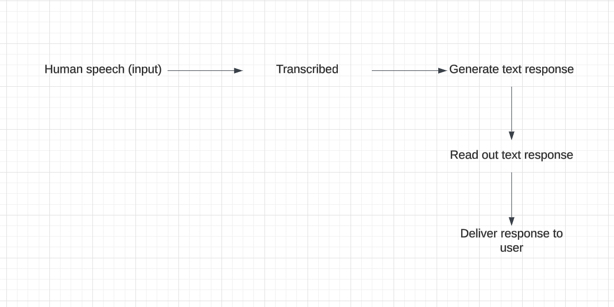

# Jabber

Jabber allows you to converse with AI using your voice. Built to demonstrate how slow commercial AI really is.

## How it works



## Features

- Real-time voice transcription
- AI-powered conversational responses
- Audio visualization

## Prerequisites

- Node.js (v18 or later)
- npm (v9 or later)
- OpenAI API Key
- UploadThing Account (for file uploads)

## Setup

1. Clone the repository:

   ```bash
   git clone https://github.com/tika/jabber.git
   cd jabber
   ```

2. Install dependencies:

   ```bash
   npm install
   ```

3. Set up environment variables:

   - Copy `.env.example` to `.env.local`
   - Fill in your OpenAI and UploadThing credentials

4. Run the development server:

   ```bash
   npm run dev
   ```

5. Open [http://localhost:3000](http://localhost:3000) in your browser

## Technologies

- Next.js 14
- OpenAI API
- Voice Activity Detection (VAD)
- Three.js for audio visualization
